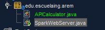
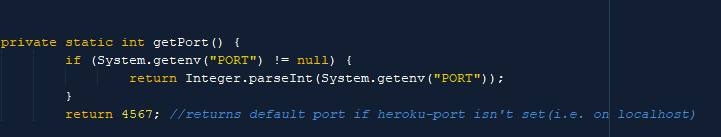
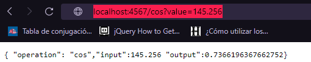
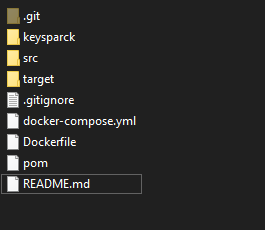
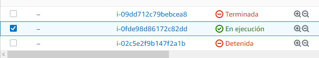
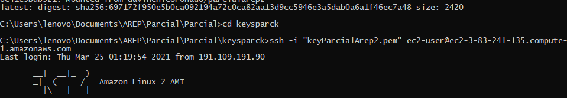
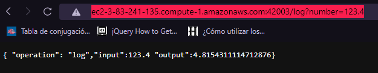

# Parcial 2 Arep AWS
## Descripción 
El siguiente proyecto permite calcular el coseno o el logaritmo base 10, sea el caso. Por medio de una pagina web.
retornando un objeto JSON, mostrando con mas detalle  los datos, operaciones y resultados obtenidos.

Este se despliega en un servidor de Amazon, el proyecto consta de la abstracción de un servidor Web al que se le puede 
hacer peticiones Http (GET),  el cual consume recursos de una API que realiza todos estos calculos (APICalculator) pasandole todos estos
datos obviamente.

Ejecutando el proyecto localmente podemos ver que el resultado es satisfactorio ya que los resultados son correctos.

Luego se agregan los archivos necesarios para crear los contenedores en Dockers y poder desplegarlo en AWS.

Despues se procede a crear una instacia de una maquina de Amazon, luego de crearla y descargar la llave se procede a configurarla y
enlasarla con el repositorio en Dockerhub.

Se realiza la prueba con el link provisto por AWS. 

El siguente link permite ver como correrlo en EC2 y su funcionamiento.
https://youtu.be/b74Oi1PlyB4

Link de la pagina en AWS(La patecion saldra error ya que la maquina estara apagada)
ec2-3-83-241-135.compute-1.amazonaws.com

